# Security-Base

> **Application complète de gestion d'incidents de sécurité** - Solution d'entreprise moderne avec Angular 20+ et Laravel 12

[](https://angular.io/)
[](https://laravel.com/)
[](https://www.typescriptlang.org/)
[](https://www.php.net/)
[](https://tailwindcss.com/)
[](https://mariadb.org/)
[]()

---
## 📋 Table des matières

- [Présentation](#-présentation)
- [Screenshots](#screenshots)
- [Architecture](#-architecture)
- [Fonctionnalités](#-fonctionnalités)
- [Installation](#-installation)
- [Configuration](#-configuration)
- [API Documentation](#-api-documentation)
- [Sécurité](#-sécurité)
- [Performance](#-performance)
- [Déploiement](#-déploiement)
- [Tests](#-tests)
- [Contribution](#-contribution)
- [License](#-license)
- [Documentation complète](#-documentation-complète)

---

## 🎯 Présentation

**Security-Base** est une application web moderne et complète de gestion d'incidents de sécurité, développée pour les équipes de sécurité informatique d'entreprise. Elle remplace une application PHP legacy lente (5 min/action) par une solution performante (<100ms par action) construite avec Angular et Laravel.

### 🎨 Architecture du projet

```
security-base/
├── frontend/              # Angular 20+ Application
│   ├── src/
│   │   ├── app/
│   │   │   ├── models/
│   │   │   ├── services/
│   │   │   ├── components/
│   │   │   └── shared/
│   │   └── assets/
│   └── package.json
│
└── backend/               # Laravel 12 API
    ├── app/
    │   ├── Http/
    │   │   ├── Controllers/
    │   │   ├── Requests/
    │   │   └── Resources/
    │   ├── Models/
    │   ├── Services/
    │   └── Mail/
    ├── database/
    │   ├── migrations/
    │   └── seeders/
    └── composer.json
```

### ⭐ Caractéristiques principales

- ✅ **Interface moderne** avec design responsive et mode sombre/clair automatique
- ✅ **Éditeur WYSIWYG** avancé (Quill.js) pour la documentation riche
- ✅ **API RESTful** performante avec Laravel 12 et Sanctum
- ✅ **Système de recherche** intelligent avec filtres avancés et suggestions
- ✅ **Gestion des colonnes** dynamique avec drag & drop et redimensionnement
- ✅ **Export multi-formats** (XLSX, PDF) avec options temporelles flexibles
- ✅ **Notifications automatisées** par email avec templates dynamiques
- ✅ **Gestion des permissions** basée sur les rôles (RBAC)
- ✅ **Architecture modulaire** avec séparation frontend/backend claire
- ✅ **Performance optimisée** : < 100ms P95 pour les opérations API
- ✅ **Production Ready** : Tests, sécurité et monitoring intégrés

### 📊 Statistiques du projet

| Métrique | Frontend | Backend |
|----------|----------|---------|
| **Lignes de code** | ~15,000 TS | ~8,000 PHP |
| **Composants/Controllers** | 25+ | 12 |
| **Services** | 12 | 8 |
| **Couverture de tests** | > 60% | > 60% |
| **Bundle size (prod)** | < 500KB | N/A |
| **Performance P95** | < 100ms | < 100ms |

---

## Screenshots

<details>
<summary>📸 Cliquez pour voir les captures d'écran</summary>

<br/>

### Vues principales

| Description | Capture |
|-------------|---------|
| Vue principale |  |
| Détail d'incident |  |
| Création d'incident |  |
| Vue création |  |
| Vue en colonnes |  |
| Vue archive |  |
| Vue corbeille |  |

### Dashboard

| Tableau de bord | Capture |
|-----------------|---------|
| Droits |  |
| Métiers |  |
| Utilisateurs |  |

### Fonctionnalités

| Fonctionnalité | Capture |
|----------------|---------|
| Recherche |  |
| Liste de diffusion |  |
| Export Excel |  |
| Export PDF |  |

### Templates et rôles

| Élément | Capture |
|---------|---------|
| Rôle métier |  |
| Liste des templates |  |
| Vue template |  |

### 📎 Documents et exports

| Type | Lien |
|------|------|
| Base d'Incidents Sécurité (PDF) | [Base d'Incidents Sécurité - Tous les incidents](docs/Base%20d'Incidents%20S%C3%A9curit%C3%A9%20-%20Tous%20les%20incidents.pdf) |
| Incident #32 (PDF) | [Incident #32 - Coupure de courant](docs/Incident%20%2332%20-%20Coupure%20de%20courant.pdf) |
| Matrice des Permissions (XLSX) | [Matrice des Permissions](docs/Matrice_Permissions_SecurityBase_2025-10-29.xlsx) |
| Liste des incidents (XLSX) | [Liste des incidents](docs/incidents-tous-2025-10-29.xlsx) |
| Patch notes | [Patch notes](docs/patch-note.txt) |

</details>

---

## 🏗 Architecture

### Vue d'ensemble système


### Flux de données applicatif

```mermaid
sequenceDiagram
    participant U as Utilisateur
    participant F as Frontend Angular
    participant A as Laravel API
    participant D as Base de données
    
    U->>F: Action (création incident)
    F->>F: Validation côté client
    F->>A: POST /api/incidents + JWT
    A->>A: Middleware Auth (Sanctum)
    A->>A: Form Request Validation
    A->>D: INSERT INTO incidents
    D-->>A: Incident créé
    A->>A: Log historique
    A-->>F: Response 201 + JSON
    F->>F: Mise à jour BehaviorSubject
    F->>U: Notification succès
```



### Stack technologique

| Couche | Technologies |
|--------|-------------|
| **Frontend** | Angular 20, TypeScript 5.8, TailwindCSS 3.4, RxJS 7.8, Quill 2.0 |
| **Backend** | Laravel 12, PHP 8.4, Sanctum Auth, Eloquent ORM |
| **Base de données** | MariaDB 11 / MySQL 8.0+ |
| **Cache** | Redis 7.x (optionnel) |
| **Outils** | Git, NPM, Composer, Docker (optionnel) |

---

## 🚀 Fonctionnalités

### 1. Gestion complète des incidents

#### Cycle de vie

```mermaid
stateDiagram-v2
    [*] --> Ouvert: Création
    Ouvert --> EnCours: Prise en charge
    EnCours --> Cloturé: Résolution
    Cloturé --> Archivé: Archivage auto
    Archivé --> Restauré: Restauration
    Restauré --> EnCours: Réouverture
    
    Ouvert --> Supprimé: Suppression
    EnCours --> Supprimé: Suppression
    Cloturé --> Supprimé: Suppression
```



#### Fonctionnalités principales

- **Création/Édition** avec formulaire détaillé et validation temps réel
- **Suppression sécurisée** avec confirmation et protection
- **Duplication intelligente** d'incidents existants
- **Suivi du statut** avec workflow personnalisable
- **Archivage et restauration** avec gestion du cycle de vie
- **Système de gravité** à 4 niveaux (Faible, Moyen, Grave, Très grave)
- **Classification multi-domaines** (Informatique, Logistique, MDA, COPIL)
- **Temps d'indisponibilité** avec saisie détaillée (jours, heures, minutes)

### 2. Recherche et filtrage avancés

- **Recherche globale** avec debounce intelligent (300ms)
- **Filtres multi-critères** : statut, gravité, domaines, dates, sites
- **Tri multi-colonnes** avec ordre ascendant/descendant
- **Pagination optimisée** avec options de taille (15/25/50/100)
- **Suggestions intelligentes** basées sur l'historique
- **Export filtré** des résultats en XLSX/PDF

### 3. Gestion des colonnes dynamique

- **Affichage/Masquage** des colonnes avec état persistant
- **Réorganisation** par drag & drop
- **Redimensionnement** manuel avec largeurs personnalisées
- **Presets** pour configurations rapides (Vue complète, Essentiel, Minimal)
- **Sauvegarde automatique** dans LocalStorage

### 4. Export et rapports

- **Export XLSX** avec formatage professionnel et filtres Excel
- **Export PDF** avec mise en page optimisée et pagination
- **Options temporelles** : Aujourd'hui, Cette semaine, Ce mois, Période personnalisée
- **Export filtré** selon les critères de recherche actifs
- **Génération asynchrone** pour gros volumes de données

### 5. Notifications et communication

- **Emails automatiques** basés sur la gravité de l'incident
- **Templates dynamiques** avec personnalisation du contenu
- **Listes de diffusion** configurables par domaine/service
- **Gestion des destinataires** avec validation des emails
- **Historique complet** des notifications envoyées

### 6. Sécurité et traçabilité

- **Authentification JWT** via middleware SSO EXTERNE
- **Permissions RBAC** par rôle (Admin, Manager, User, Viewer)
- **Historique complet** des modifications avec author tracking
- **Audit logs** pour toutes les actions sensibles
- **Soft deletes** pour récupération des données supprimées

---

## 📦 Installation

### Prérequis système

| Outil | Version minimale | Recommandé |
|-------|-----------------|------------|
| **Node.js** | 18.0.0 | 20.x LTS |
| **NPM** | 9.0.0 | Latest |
| **PHP** | 8.4.0 | 8.4+ |
| **Composer** | 2.0 | Latest |
| **MariaDB** | 10.4 | 11.x |
| **Redis** | 6.0 | 7.x (optionnel) |

### Installation rapide

```bash
# 1. Cloner le repository
git clone https://github.com/Ninewashburn/security-base.git
cd security-base

# 2. Installation Frontend (Angular)
cd frontend
npm install
cp src/environments/environment.example.ts src/environments/environment.ts
# Éditer environment.ts avec vos configurations

# 3. Installation Backend (Laravel)
cd ../backend
composer install
cp .env.example .env
php artisan key:generate
# Éditer .env avec vos configurations database

# 4. Créer la base de données
mysql -u root -p -e "CREATE DATABASE security-base CHARACTER SET utf8mb4 COLLATE utf8mb4_unicode_ci;"

# 5. Lancer les migrations
php artisan migrate --seed

# 6. Démarrer les serveurs de développement
# Terminal 1 - Frontend
cd frontend
ng serve
# Accessible sur http://localhost:4200

# Terminal 2 - Backend
cd backend
php artisan serve
# Accessible sur http://localhost:8000
```

### Installation avec Docker (optionnel)

```bash
# Frontend
cd frontend
docker build -t security-base-frontend .
docker run -p 4200:4200 security-base-frontend

# Backend avec Laravel Sail
cd backend
composer require laravel/sail --dev
php artisan sail:install
./vendor/bin/sail up -d
./vendor/bin/sail artisan migrate --seed
```

---

## ⚙️ Configuration

### Frontend (Angular)

```typescript
// src/environments/environment.ts
export const environment = {
  production: false,
  apiUrl: 'http://localhost:8000/api',
  ssoUrl: 'https://sso.ninewashburn.recouv',
  
  // Features
  enableDarkMode: true,
  enableNotifications: true,
  enableExport: true,
  
  // Pagination
  defaultPageSize: 15,
  pageSizeOptions: [15, 25, 50, 100],
  
  // Performance
  searchDebounceTime: 300,
  cacheExpiration: 300000, // 5 minutes
  
  // Export
  maxExportRows: 5000,
  exportFormats: ['xlsx', 'pdf'],
};
```

### Backend (Laravel)

```bash
# .env
APP_NAME="Security-Base API"
APP_ENV=local
APP_DEBUG=true
APP_URL=http://localhost:8000
APP_TIMEZONE=UTC  # IMPORTANT: Toujours UTC

# Base de données
DB_CONNECTION=mysql
DB_HOST=127.0.0.1
DB_PORT=3306
DB_DATABASE=security-base
DB_USERNAME=root
DB_PASSWORD=
DB_TIMEZONE=+00:00  # Force UTC pour éviter problèmes timezone

# Cache (Redis en production)
CACHE_DRIVER=redis
REDIS_HOST=127.0.0.1
REDIS_PASSWORD=null
REDIS_PORT=6379

# Mail (SMTP en production)
MAIL_MAILER=smtp
MAIL_HOST=smtp.ninewashburn.fr
MAIL_PORT=587
MAIL_USERNAME=noreply@ninewashburn.fr
MAIL_PASSWORD=
MAIL_ENCRYPTION=tls
MAIL_FROM_ADDRESS="noreply@security-base.fr"
MAIL_FROM_NAME="${APP_NAME}"

# CORS
SANCTUM_STATEFUL_DOMAINS=localhost:4200,app.ninewashburn.recouv

# JWT
JWT_SECRET=your-secret-key
JWT_TTL=3600  # 1 heure
```

---

## 🔌 API Documentation

### Endpoints principaux

| Méthode | Endpoint | Description | Auth |
|---------|----------|-------------|------|
| `GET` | `/api/incidents` | Liste paginée des incidents | ✅ |
| `GET` | `/api/incidents/{id}` | Détail d'un incident | ✅ |
| `POST` | `/api/incidents` | Créer un incident | ✅ |
| `PATCH` | `/api/incidents/{id}` | Modifier un incident | ✅ |
| `DELETE` | `/api/incidents/{id}` | Supprimer un incident | ✅ |
| `PATCH` | `/api/incidents/{id}/archive` | Archiver un incident | ✅ |
| `PATCH` | `/api/incidents/{id}/restore` | Restaurer un incident | ✅ |
| `GET` | `/api/diffusion-lists` | Liste des groupes de diffusion | ✅ |
| `POST` | `/api/diffusion-lists` | Créer un groupe | ✅ |
| `GET` | `/api/export/xlsx` | Export Excel | ✅ |
| `GET` | `/api/export/pdf` | Export PDF | ✅ |

### Format des réponses

```json
// Succès (200/201)
{
  "data": {
    "id": 1,
    "object": "Incident de sécurité",
    "description": "Description détaillée",
    "gravity": "grave",
    "status": "ouvert",
    "domains": ["Informatique", "Logistique"],
    "dateOuverture": "2025-11-10T10:30:00Z",
    "dateCloture": null,
    "author": {
      "id": 123,
      "name": "John Doe",
      "email": "john@test.fr"
    }
  },
  "meta": {
    "timestamp": "2025-11-10T10:30:00Z"
  }
}

// Liste paginée (200)
{
  "data": [...],
  "meta": {
    "current_page": 1,
    "total": 150,
    "per_page": 15,
    "last_page": 10
  },
  "links": {
    "first": "/api/incidents?page=1",
    "last": "/api/incidents?page=10",
    "prev": null,
    "next": "/api/incidents?page=2"
  }
}

// Erreur (422)
{
  "message": "Validation failed",
  "errors": {
    "object": ["The object field is required."],
    "gravity": ["The selected gravity is invalid."]
  }
}

// Erreur (401/403)
{
  "message": "Unauthorized",
  "error": "Invalid or expired token"
}
```

### Authentification

```bash
# Header requis pour toutes les requêtes
Authorization: Bearer {JWT_TOKEN}
Content-Type: application/json
Accept: application/json
```

### Exemples de requêtes

```bash
# Créer un incident
curl -X POST http://localhost:8000/api/incidents \
  -H "Authorization: Bearer YOUR_JWT_TOKEN" \
  -H "Content-Type: application/json" \
  -d '{
    "object": "Intrusion détectée",
    "description": "Tentative d accès non autorisé",
    "domains": ["Informatique"],
    "gravity": "tres_grave",
    "status": "ouvert",
    "sites": ["Site A", "Site B"]
  }'

# Récupérer les incidents avec filtres
curl -X GET "http://localhost:8000/api/incidents?status=ouvert&gravity=grave&page=1&per_page=25" \
  -H "Authorization: Bearer YOUR_JWT_TOKEN"

# Archiver un incident
curl -X PATCH http://localhost:8000/api/incidents/1/archive \
  -H "Authorization: Bearer YOUR_JWT_TOKEN" \
  -H "Content-Type: application/json" \
  -d '{"notes": "Archivage automatique après résolution"}'

# Export Excel avec filtres
curl -X GET "http://localhost:8000/api/export/xlsx?status=ouvert&startDate=2025-01-01" \
  -H "Authorization: Bearer YOUR_JWT_TOKEN" \
  --output incidents.xlsx
```

---

## 🔒 Sécurité

### Authentification JWT

```typescript
// Frontend - Auth Interceptor
@Injectable()
export class AuthInterceptor implements HttpInterceptor {
  intercept(req: HttpRequest<any>, next: HttpHandler): Observable<HttpEvent<any>> {
    const token = this.authService.getToken();
    
    if (token) {
      req = req.clone({
        setHeaders: {
          Authorization: `Bearer ${token}`,
          'Content-Type': 'application/json',
          'Accept': 'application/json'
        }
      });
    }
    
    return next.handle(req).pipe(
      catchError((error: HttpErrorResponse) => {
        if (error.status === 401) {
          this.authService.logout();
          this.router.navigate(['/login']);
        }
        return throwError(() => error);
      })
    );
  }
}
```

```php
// Backend - Middleware Sanctum
// routes/api.php
Route::middleware(['auth:sanctum'])->group(function () {
    Route::apiResource('incidents', IncidentController::class);
    Route::patch('incidents/{id}/archive', [IncidentController::class, 'archive']);
});

// app/Http/Kernel.php
protected $middlewareGroups = [
    'api' => [
        \Laravel\Sanctum\Http\Middleware\EnsureFrontendRequestsAreStateful::class,
        'throttle:api',
        \Illuminate\Routing\Middleware\SubstituteBindings::class,
    ],
];
```

### Permissions RBAC

```typescript
// Frontend - Route Guards
@Injectable({ providedIn: 'root' })
export class AdminGuard implements CanActivate {
  canActivate(route: ActivatedRouteSnapshot): boolean {
    const permissions = this.authService.getUserPermissions();
    
    if (!permissions.includes('admin')) {
      this.router.navigate(['/unauthorized']);
      return false;
    }
    
    return true;
  }
}

// Utilisation dans les routes
const routes: Routes = [
  {
    path: 'admin',
    component: AdminComponent,
    canActivate: [AdminGuard]
  }
];
```

```php
// Backend - Policies Laravel
// app/Policies/IncidentPolicy.php
class IncidentPolicy
{
    public function update(User $user, Incident $incident): bool
    {
        // Admin peut tout modifier
        if ($user->hasRole('admin')) {
            return true;
        }
        
        // Manager peut modifier incidents de son domaine
        if ($user->hasRole('manager')) {
            return in_array($user->domain, $incident->domains);
        }
        
        // User peut modifier ses propres incidents
        return $user->id === $incident->user_id;
    }
    
    public function delete(User $user, Incident $incident): bool
    {
        // Seuls admin et l'auteur peuvent supprimer
        return $user->hasRole('admin') || $user->id === $incident->user_id;
    }
}

// Utilisation dans les controllers
public function update(UpdateIncidentRequest $request, Incident $incident)
{
    $this->authorize('update', $incident);
    
    $incident->update($request->validated());
    
    return new IncidentResource($incident);
}
```

### Protection CSRF et XSS

```typescript
// Frontend - Sanitization
import { DomSanitizer } from '@angular/platform-browser';

export class IncidentComponent {
  constructor(private sanitizer: DomSanitizer) {}
  
  get safeDescription() {
    return this.sanitizer.sanitize(
      SecurityContext.HTML,
      this.incident.description
    );
  }
}
```

```php
// Backend - Validation et Sanitization
// app/Http/Requests/StoreIncidentRequest.php
class StoreIncidentRequest extends FormRequest
{
    public function rules(): array
    {
        return [
            'object' => 'required|string|max:255|regex:/^[a-zA-Z0-9\s\-\_\.]+$/',
            'description' => 'required|string|max:5000',
            'gravity' => 'required|in:faible,moyen,grave,tres_grave',
            'domains' => 'required|array|min:1',
            'domains.*' => 'string|in:Informatique,Logistique,MDA,COPIL',
            'sites' => 'nullable|array',
            'sites.*' => 'string|max:100',
        ];
    }
    
    protected function prepareForValidation()
    {
        $this->merge([
            'object' => strip_tags($this->object),
            'description' => strip_tags($this->description, '<p><br><strong><em><ul><li>'),
        ]);
    }
}
```

### Rate Limiting

```php
// config/sanctum.php
'middleware' => [
    'throttle:api',  // 60 requêtes/minute par défaut
],

// routes/api.php - Rate limiting personnalisé
Route::middleware(['auth:sanctum', 'throttle:export'])->group(function () {
    Route::get('export/xlsx', [ExportController::class, 'xlsx']);
    Route::get('export/pdf', [ExportController::class, 'pdf']);
});

// app/Providers/RouteServiceProvider.php
RateLimiter::for('export', function (Request $request) {
    return Limit::perMinute(5)->by($request->user()?->id ?: $request->ip());
});
```

---

## ⚡ Performance

### Optimisations Frontend

```typescript
// 1. Lazy Loading des modules
const routes: Routes = [
  {
    path: 'admin',
    loadChildren: () => import('./admin/admin.module').then(m => m.AdminModule)
  }
];

// 2. OnPush Change Detection
@Component({
  selector: 'app-incident-list',
  changeDetection: ChangeDetectionStrategy.OnPush
})

// 3. TrackBy pour *ngFor
@Component({
  template: `
    @for (incident of incidents; track trackById(incident)) {
      <app-incident-row [incident]="incident" />
    }
  `
})
export class IncidentListComponent {
  trackById(incident: Incident): number {
    return incident.id;
  }
}

// 4. Cache avec BehaviorSubject
@Injectable({ providedIn: 'root' })
export class IncidentDataService {
  private cache = new BehaviorSubject<Incident[]>([]);
  private cacheTime = 0;
  private CACHE_DURATION = 5 * 60 * 1000; // 5 minutes
  
  getIncidents(forceRefresh = false): Observable<Incident[]> {
    if (!forceRefresh && Date.now() - this.cacheTime < this.CACHE_DURATION) {
      return this.cache.asObservable();
    }
    
    return this.http.get<Incident[]>('/api/incidents').pipe(
      tap(data => {
        this.cache.next(data);
        this.cacheTime = Date.now();
      })
    );
  }
}

// 5. Virtual Scrolling pour grandes listes
import { CdkVirtualScrollViewport } from '@angular/cdk/scrolling';

@Component({
  template: `
    <cdk-virtual-scroll-viewport itemSize="50" class="h-full">
      @for (item of items; track item.id) {
        <div class="item">{{ item.name }}</div>
      }
    </cdk-virtual-scroll-viewport>
  `
})
```

### Optimisations Backend

```php
// 1. Eager Loading pour éviter N+1 queries
public function index()
{
    $incidents = Incident::with(['user', 'histories'])
        ->paginate(15);
    
    return IncidentResource::collection($incidents);
}

// 2. Query scopes pour réutilisation
// app/Models/Incident.php
public function scopeActive($query)
{
    return $query->whereIn('status', ['ouvert', 'en_cours']);
}

public function scopeByGravity($query, $gravity)
{
    return $query->where('gravity', $gravity);
}

// Utilisation
$incidents = Incident::active()->byGravity('grave')->get();

// 3. Index database pour recherche
Schema::table('incidents', function (Blueprint $table) {
    $table->index(['status', 'created_at']);
    $table->index('gravity');
    $table->fullText(['object', 'description']);
});

// 4. Cache Redis
use Illuminate\Support\Facades\Cache;

public function index(Request $request)
{
    $cacheKey = 'incidents_' . md5(json_encode($request->all()));
    
    return Cache::remember($cacheKey, 300, function () use ($request) {
        return Incident::with('user')
            ->filter($request->all())
            ->paginate(15);
    });
}

// 5. Queue Jobs pour tâches longues
use App\Jobs\SendIncidentNotification;

public function store(StoreIncidentRequest $request)
{
    $incident = Incident::create($request->validated());
    
    // Envoi asynchrone
    SendIncidentNotification::dispatch($incident);
    
    return new IncidentResource($incident);
}
```

### Métriques de performance

```bash
# Objectifs de performance
- API response time P95: < 100ms
- Frontend initial load: < 2s
- Time to interactive: < 3s
- Bundle size: < 500KB (gzipped)
- Database query time: < 50ms
- Cache hit rate: > 80%
```

---

## 🚀 Déploiement

### Production - Frontend (Angular)

```bash
# 1. Build de production
cd frontend
npm run build -- --configuration production

# 2. Le dossier dist/ contient les fichiers à déployer
# Configuration Nginx
server {
    listen 80;
    server_name app.ninewashburn.recouv;
    
    root /var/www/security-base/frontend/dist/security-base;
    index index.html;
    
    location / {
        try_files $uri $uri/ /index.html;
    }
    
    location /api {
        proxy_pass http://localhost:8000;
        proxy_http_version 1.1;
        proxy_set_header Upgrade $http_upgrade;
        proxy_set_header Connection 'upgrade';
        proxy_set_header Host $host;
        proxy_cache_bypass $http_upgrade;
    }
    
    # Gzip compression
    gzip on;
    gzip_types text/css application/javascript application/json;
    
    # Cache static assets
    location ~* \.(js|css|png|jpg|jpeg|gif|ico|svg|woff|woff2)$ {
        expires 1y;
        add_header Cache-Control "public, immutable";
    }
}
```

### Production - Backend (Laravel)

```bash
# 1. Optimisations Laravel
cd backend

# Cache de configuration
php artisan config:cache

# Cache des routes
php artisan route:cache

# Cache des vues
php artisan view:cache

# Optimiser l'autoloader Composer
composer install --optimize-autoloader --no-dev

# 2. Configuration .env production
APP_ENV=production
APP_DEBUG=false
APP_URL=https://api.ninewashburn

DB_CONNECTION=mysql
DB_HOST=db-prod.ninewashburn
DB_DATABASE=security-base
DB_USERNAME=security-ninewashburn
DB_PASSWORD=STRONG_PASSWORD

CACHE_DRIVER=redis
SESSION_DRIVER=redis
QUEUE_CONNECTION=redis

REDIS_HOST=redis-prod.ninewashburn
REDIS_PASSWORD=REDIS_PASSWORD

# 3. Configuration Nginx pour Laravel
server {
    listen 443 ssl http2;
    server_name api.ninewashburn;
    
    root /var/www/security-base/backend/public;
    index index.php;
    
    ssl_certificate /etc/ssl/certs/ninewashburn.crt;
    ssl_certificate_key /etc/ssl/private/ninewashburn.key;
    
    location / {
        try_files $uri $uri/ /index.php?$query_string;
    }
    
    location ~ \.php$ {
        fastcgi_pass unix:/var/run/php/php8.4-fpm.sock;
        fastcgi_index index.php;
        fastcgi_param SCRIPT_FILENAME $realpath_root$fastcgi_script_name;
        include fastcgi_params;
    }
    
    location ~ /\.(?!well-known).* {
        deny all;
    }
}

# 4. Supervisor pour Queue Workers
# /etc/supervisor/conf.d/security-base-worker.conf
[program:security-base-worker]
process_name=%(program_name)s_%(process_num)02d
command=php /var/www/security-base/backend/artisan queue:work redis --sleep=3 --tries=3 --max-time=3600
autostart=true
autorestart=true
user=www-data
numprocs=4
redirect_stderr=true
stdout_logfile=/var/www/security-base/backend/storage/logs/worker.log
```

### Docker Compose (Production)

```yaml
version: '3.8'

services:
  frontend:
    build:
      context: ./frontend
      dockerfile: Dockerfile.prod
    ports:
      - "80:80"
      - "443:443"
    volumes:
      - ./nginx.conf:/etc/nginx/nginx.conf
      - ./ssl:/etc/ssl
    depends_on:
      - backend
    restart: unless-stopped
  
  backend:
    build:
      context: ./backend
      dockerfile: Dockerfile
    volumes:
      - ./backend:/var/www
      - ./backend/.env.production:/var/www/.env
    depends_on:
      - database
      - redis
    restart: unless-stopped
  
  database:
    image: mariadb:11
    environment:
      MYSQL_ROOT_PASSWORD: ${DB_ROOT_PASSWORD}
      MYSQL_DATABASE: ${DB_DATABASE}
      MYSQL_USER: ${DB_USERNAME}
      MYSQL_PASSWORD: ${DB_PASSWORD}
    volumes:
      - db-data:/var/lib/mysql
    restart: unless-stopped
  
  redis:
    image: redis:7-alpine
    command: redis-server --requirepass ${REDIS_PASSWORD}
    volumes:
      - redis-data:/data
    restart: unless-stopped

volumes:
  db-data:
  redis-data:
```

---

## 🧪 Tests

### Frontend - Angular

```bash
# Tests unitaires
cd frontend
npm test

# Tests avec couverture
npm run test:coverage

# Tests e2e
npm run e2e

# Lint
npm run lint
```

```typescript
// Exemple de test unitaire
describe('IncidentDataService', () => {
  let service: IncidentDataService;
  let httpMock: HttpTestingController;
  
  beforeEach(() => {
    TestBed.configureTestingModule({
      imports: [HttpClientTestingModule],
      providers: [IncidentDataService]
    });
    
    service = TestBed.inject(IncidentDataService);
    httpMock = TestBed.inject(HttpTestingController);
  });
  
  it('should cache incidents and avoid duplicate requests', () => {
    const mockIncidents = [{ id: 1, object: 'Test' }];
    
    // Premier appel
    service.loadIncidents().subscribe();
    const req1 = httpMock.expectOne('/api/incidents');
    req1.flush({ data: mockIncidents });
    
    // Deuxième appel - devrait utiliser le cache
    service.loadIncidents().subscribe(data => {
      expect(data).toEqual(mockIncidents);
    });
    
    // Vérifier qu'aucune requête HTTP supplémentaire n'a été faite
    httpMock.verify();
  });
  
  it('should handle errors gracefully', () => {
    service.loadIncidents().subscribe({
      error: (error) => {
        expect(error).toBeDefined();
        expect(error.message).toContain('Failed to load incidents');
      }
    });
    
    const req = httpMock.expectOne('/api/incidents');
    req.flush('Error', { status: 500, statusText: 'Server Error' });
  });
});
```

### Backend - Laravel

```bash
# Tests unitaires et feature
cd backend
php artisan test

# Tests avec couverture
php artisan test --coverage

# Tests spécifiques
php artisan test --filter IncidentControllerTest

# PHPStan (analyse statique)
./vendor/bin/phpstan analyse
```

```php
// tests/Feature/IncidentControllerTest.php
<?php

namespace Tests\Feature;

use App\Models\User;
use App\Models\Incident;
use Illuminate\Foundation\Testing\RefreshDatabase;
use Tests\TestCase;

class IncidentControllerTest extends TestCase
{
    use RefreshDatabase;
    
    public function test_can_list_incidents_with_pagination(): void
    {
        $user = User::factory()->create();
        Incident::factory()->count(25)->create();
        
        $response = $this->actingAs($user, 'sanctum')
            ->getJson('/api/incidents?page=1&per_page=15');
        
        $response->assertStatus(200)
            ->assertJsonStructure([
                'data' => [
                    '*' => ['id', 'object', 'gravity', 'status', 'dateOuverture']
                ],
                'meta' => ['current_page', 'total', 'per_page', 'last_page'],
                'links'
            ])
            ->assertJsonCount(15, 'data');
    }
    
    public function test_can_create_incident_with_valid_data(): void
    {
        $user = User::factory()->create(['role' => 'admin']);
        
        $data = [
            'object' => 'Incident de test',
            'description' => 'Description détaillée',
            'domains' => ['Informatique', 'Logistique'],
            'gravity' => 'grave',
            'status' => 'ouvert',
            'sites' => ['Site A']
        ];
        
        $response = $this->actingAs($user, 'sanctum')
            ->postJson('/api/incidents', $data);
        
        $response->assertStatus(201)
            ->assertJsonFragment(['object' => 'Incident de test']);
        
        $this->assertDatabaseHas('incidents', [
            'object' => 'Incident de test',
            'gravity' => 'grave'
        ]);
    }
    
    public function test_validation_fails_without_required_fields(): void
    {
        $user = User::factory()->create();
        
        $response = $this->actingAs($user, 'sanctum')
            ->postJson('/api/incidents', []);
        
        $response->assertStatus(422)
            ->assertJsonValidationErrors([
                'object',
                'description',
                'domains',
                'gravity'
            ]);
    }
    
    public function test_cannot_delete_incident_without_permission(): void
    {
        $user = User::factory()->create(['role' => 'viewer']);
        $incident = Incident::factory()->create();
        
        $response = $this->actingAs($user, 'sanctum')
            ->deleteJson("/api/incidents/{$incident->id}");
        
        $response->assertStatus(403);
    }
}
```

### Tests de performance

```bash
# Apache Bench
ab -n 1000 -c 10 -H "Authorization: Bearer TOKEN" \
   http://localhost:8000/api/incidents

# Artillery (load testing)
artillery quick --count 100 --num 10 http://localhost:8000/api/incidents

# Lighthouse (frontend performance)
npm install -g lighthouse
lighthouse http://localhost:4200 --view
```

---

## 🤝 Contribution

### Standards de code

**TypeScript/Angular**
```typescript
// ✅ Bonnes pratiques
- Composants standalone
- Services providedIn: 'root'
- Typage strict (strict mode activé)
- Nommage explicite et conventionnel
- Observables avec suffix $
- Constantes en SCREAMING_SNAKE_CASE
- Gestion d'erreurs explicite avec catchError
```

**PHP/Laravel**
```php
// ✅ Bonnes pratiques
- Type hints strict (declare(strict_types=1))
- Nommage explicite et descriptif
- Early returns pour lisibilité
- Service layer pour logique complexe
- Resource classes pour transformation JSON
- Form Requests pour validation
- Policies pour autorisations
```

### Convention de commits

```bash
# Format: <type>(<scope>): <subject>

# Types
feat:     Nouvelle fonctionnalité
fix:      Correction de bug
docs:     Documentation uniquement
style:    Formatage (sans changement de code)
refactor: Refactoring (sans feat/fix)
perf:     Amélioration performance
test:     Ajout/modification de tests
chore:    Maintenance (build, CI, etc.)

# Exemples
git commit -m "feat(incidents): add PDF export functionality"
git commit -m "fix(auth): resolve JWT token expiration issue"
git commit -m "docs(readme): update installation instructions"
git commit -m "refactor(services): simplify cache management"
git commit -m "perf(queries): add database indexes for search"
git commit -m "test(export): add unit tests for XLSX generation"
```

### Workflow de contribution

```bash
# 1. Fork le repository
git clone https://github.com/YOUR_USERNAME/security-base.git
cd security-base

# 2. Créer une branche feature
git checkout -b feature/amazing-feature

# 3. Développer et commit
git add .
git commit -m "feat(module): add amazing feature"

# 4. Pousser vers le fork
git push origin feature/amazing-feature

# 5. Créer une Pull Request sur GitHub

# 6. Après review et merge
git checkout main
git pull upstream main
git branch -d feature/amazing-feature
```

### Checklist Pull Request

```markdown
## Description
Brief description of what this PR does

## Type de changement
- [ ] Bug fix
- [ ] New feature
- [ ] Breaking change
- [ ] Documentation update

## Tests effectués
- [ ] Tests unitaires ajoutés/modifiés
- [ ] Tests passent localement
- [ ] Tests e2e passent
- [ ] Vérification manuelle effectuée

## Checklist
- [ ] Code suit les standards du projet
- [ ] Self-review effectuée
- [ ] Documentation mise à jour
- [ ] Pas de nouveaux warnings
- [ ] Couverture de tests > 60%
```

---

## 📄 License

Ce projet est sous licence **MIT**.

```
MIT License

Copyright (c) 2025 Ninewashburn - Équipe Sécurité Informatique

Permission is hereby granted, free of charge, to any person obtaining a copy
of this software and associated documentation files (the "Software"), to deal
in the Software without restriction, including without limitation the rights
to use, copy, modify, merge, publish, distribute, sublicense, and/or sell
copies of the Software, and to permit persons to whom the Software is
furnished to do so, subject to the following conditions:

The above copyright notice and this permission notice shall be included in all
copies or substantial portions of the Software.

THE SOFTWARE IS PROVIDED "AS IS", WITHOUT WARRANTY OF ANY KIND, EXPRESS OR
IMPLIED, INCLUDING BUT NOT LIMITED TO THE WARRANTIES OF MERCHANTABILITY,
FITNESS FOR A PARTICULAR PURPOSE AND NONINFRINGEMENT.
```

## 📝 Documentation complète

### Frontend Angular

Retrouvez le guide complet sur le frontend Angular (installation, configuration, architecture, bonnes pratiques) :

👉 [README Angular détaillé](docs/README%20angular%20final.md)

**Contenu :**
- Installation et configuration
- Architecture des composants et services
- Gestion de l'état avec RxJS
- Personnalisation des thèmes
- Tests unitaires et E2E
- Optimisations de performance

### Backend Laravel

Retrouvez le guide complet du backend API Laravel 12 (installation, endpoints, sécurité, déploiement) :

👉 [README Laravel détaillé](docs/README%20laravel%20final.md)

**Contenu :**
- Installation et prérequis
- Configuration de la base de données
- Documentation des endpoints API
- Authentification JWT avec Sanctum
- Gestion des permissions
- Déploiement en production

---

## 📞 Support et Contact

### Ressources

- 📖 **Documentation** : [Wiki du projet](https://github.com/ninewashburn/security-base/wiki)
- 🐛 **Issues** : [GitHub Issues](https://github.com/ninewashburn/security-base/issues)
- 💬 **Discussions** : [GitHub Discussions](https://github.com/ninewashburn/security-base/discussions)
- 📧 **Email** : meynadier.renaud@gmail.com

---

<div align="center">

**Made with ❤️ by Security Team**

[⬆ Retour en haut](#security-base)

</div>
