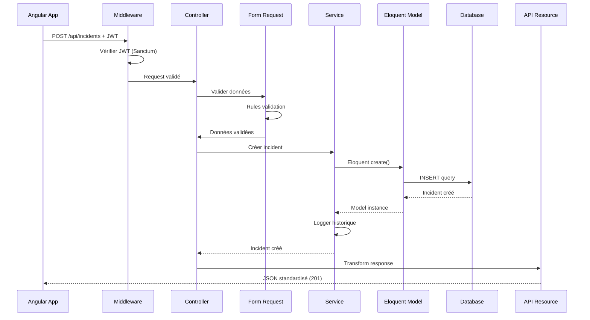
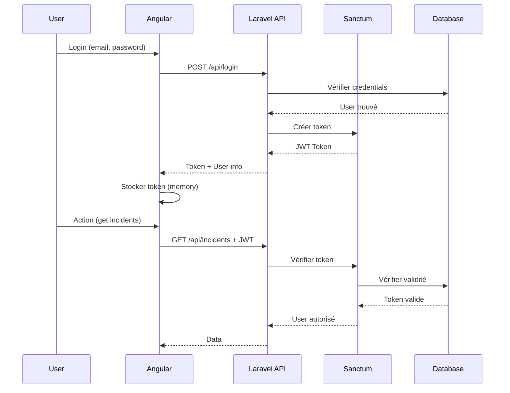

# Security-Base-Laravel API

> **API RESTful backend** pour l'application de gestion d'incidents de sécurité Security-Base

[](https://laravel.com/)
[](https://www.php.net/)
[](https://mariadb.org/)
[](https://laravel.com/docs/sanctum)
[]()

---

## 📋 Table des matières

- [Présentation](#-présentation)
- [Architecture](#-architecture)
- [Installation](#-installation)
- [Configuration](#️-configuration)
- [API Documentation](#-api-documentation)
- [Authentification](#-authentification)
- [Déploiement](#-déploiement)
- [Sécurité](#-sécurité)
- [Performance](#-performance)
- [Tests](#-tests)
- [Monitoring](#-monitoring)
- [Timezone Management](#-timezone-management)
- [Contribution](#-contribution)
- [License](#-license)

---

## 🎯 Présentation

**Security-Base-Laravel** est l'API backend RESTful qui alimente l'application Angular de gestion d'incidents de sécurité. Construite avec Laravel 11, elle offre une solution robuste, performante et sécurisée pour gérer les données d'incidents.

### Rôle de l'application

Cette application Laravel sert de backend RESTful pour le frontend [Security-Base-Angular](../Security-Base-Angular/). Elle est responsable de :

- ✅ **Gestion de la logique métier** des incidents de sécurité
- ✅ **Persistance des données** dans une base de données MariaDB/MySQL
- ✅ **Gestion des utilisateurs** et système de permissions
- ✅ **Authentification JWT** via Laravel Sanctum
- ✅ **Envoi de notifications** par email avec templates
- ✅ **Historique des modifications** avec traçabilité complète
- ✅ **Export de données** (XLSX, PDF) côté serveur
- ✅ **Validation des données** avec Form Requests
- ✅ **API Resources** pour transformation JSON standardisée

### Caractéristiques principales

| Fonctionnalité | Description |
|---------------|-------------|
| **API RESTful** | Routes standardisées, réponses JSON uniformes |
| **Performance** | Response time < 100ms P95, pagination optimisée |
| **Sécurité** | JWT, CSRF protection, rate limiting, input validation |
| **Scalabilité** | Support 50-200 users simultanés, cache Redis |
| **Traçabilité** | Historique complet, soft deletes, audit logs |
| **Notifications** | Emails automatiques, templates dynamiques |

---

## 🏗 Architecture

### Architecture globale

```mermaid
graph TB
    subgraph "Frontend"
        A[Angular App]
    end
    
    subgraph "Backend - Laravel 11"
        B[Routes API]
        C[Middleware]
        D[Controllers]
        E[Form Requests]
        F[Services]
        G[Models Eloquent]
        H[API Resources]
    end
    
    subgraph "Authentification"
        I[Sanctum Middleware]
        J[JWT Tokens]
    end
    
    subgraph "Base de données"
        K[(MariaDB/MySQL)]
        L[Migrations]
        M[Seeders]
    end
    
    subgraph "Cache & Queue"
        N[Redis Cache]
        O[Queue Jobs]
    end
    
    A -->|HTTP + JWT| B
    B --> C
    C --> I
    I --> J
    J --> D
    D --> E
    E --> F
    F --> G
    G --> K
    G --> N
    F --> O
    D --> H
    H --> A
    
    L --> K
    M --> K
    
    style A fill:#DD0031
    style D fill:#FF2D20
    style K fill:#003545
    style I fill:#FFA500
```



### Structure du projet

```
app/
├── Http/
│   ├── Controllers/         # Contrôleurs API
│   │   ├── IncidentController.php
│   │   ├── DiffusionListController.php
│   │   └── AuthController.php
│   ├── Middleware/          # Middleware personnalisés
│   │   ├── EnsureTokenIsValid.php
│   │   └── LogApiRequests.php
│   ├── Requests/            # Form Requests (validation)
│   │   ├── StoreIncidentRequest.php
│   │   └── UpdateIncidentRequest.php
│   └── Resources/           # API Resources (transformation JSON)
│       ├── IncidentResource.php
│       └── IncidentCollection.php
│
├── Models/                  # Eloquent Models
│   ├── Incident.php
│   ├── IncidentHistory.php
│   └── User.php
│
├── Services/                # Logique métier complexe
│   ├── IncidentService.php
│   ├── NotificationService.php
│   └── ExportService.php
│
├── Policies/                # Policies d'autorisation
│   └── IncidentPolicy.php
│
├── Mail/                    # Classes Mail
│   └── IncidentNotification.php
│
└── Jobs/                    # Queue Jobs
    └── SendIncidentNotification.php

database/
├── migrations/              # Migrations de base de données
├── seeders/                 # Seeders pour données initiales
└── factories/               # Factories pour tests

routes/
├── api.php                  # Routes API
└── web.php                  # Routes web (minimal)

config/
├── app.php                  # Configuration application
├── database.php             # Configuration BDD
├── sanctum.php              # Configuration Sanctum
└── cors.php                 # Configuration CORS
```

### Flux d'une requête API



---

## 📦 Installation

### Prérequis système

| Outil | Version minimale | Recommandé |
|-------|-----------------|------------|
| **PHP** | 8.4.0 | 8.4+ |
| **Composer** | 2.0 | Latest |
| **MariaDB** | 10.4 | 11.x |
| **MySQL** | 8.0 | 8.3+ |
| **Redis** | 6.0 | 7.x (optionnel) |
| **Nginx/Apache** | - | Latest |

### Extensions PHP requises

```bash
# Vérifier les extensions PHP installées
php -m

# Extensions requises
php-mbstring
php-xml
php-curl
php-pdo
php-pdo_mysql
php-zip
php-gd
php-intl
php-bcmath
```

### Installation rapide

```bash
# 1. Cloner le repository
git clone https://github.com/urssaf/security-base.git
cd security-base/Security-Base-Laravel

# 2. Installer les dépendances PHP
composer install

# 3. Copier le fichier d'environnement
cp .env.example .env

# 4. Générer la clé d'application
php artisan key:generate

# 5. Configurer la base de données dans .env
# DB_CONNECTION=mysql
# DB_HOST=127.0.0.1
# DB_PORT=3306
# DB_DATABASE=security_base
# DB_USERNAME=root
# DB_PASSWORD=

# 6. Créer la base de données
mysql -u root -p -e "CREATE DATABASE security_base CHARACTER SET utf8mb4 COLLATE utf8mb4_unicode_ci;"

# 7. Lancer les migrations et seeders
php artisan migrate --seed

# 8. Démarrer le serveur de développement
php artisan serve
# L'API est accessible sur http://localhost:8000
```

### Installation avec Docker (optionnel)

```bash
# Utiliser Laravel Sail
composer require laravel/sail --dev
php artisan sail:install

# Démarrer les containers
./vendor/bin/sail up -d

# Lancer les migrations
./vendor/bin/sail artisan migrate --seed
```

### Vérification de l'installation

```bash
# Vérifier la version de PHP
php -v
# PHP 8.4.x ou supérieur

# Vérifier Composer
composer --version

# Tester l'API
curl http://localhost:8000/api/health
# Devrait retourner: {"status": "ok", "timestamp": "..."}
```

---

## ⚙️ Configuration

### Configuration des environnements

#### Développement (`.env`)

```bash
APP_NAME="Security-Base API"
APP_ENV=local
APP_DEBUG=true
APP_URL=http://localhost:8000

# Base de données
DB_CONNECTION=mysql
DB_HOST=127.0.0.1
DB_PORT=3306
DB_DATABASE=security_base
DB_USERNAME=root
DB_PASSWORD=
DB_TIMEZONE=+00:00  # IMPORTANT: UTC pour éviter problèmes timezone

# Cache (optionnel en dev)
CACHE_DRIVER=file
SESSION_DRIVER=file
QUEUE_CONNECTION=sync

# Mail (Mailtrap en dev)
MAIL_MAILER=smtp
MAIL_HOST=sandbox.smtp.mailtrap.io
MAIL_PORT=2525
MAIL_USERNAME=your_username
MAIL_PASSWORD=your_password
MAIL_ENCRYPTION=tls
MAIL_FROM_ADDRESS="noreply@security-base.fr"
MAIL_FROM_NAME="${APP_NAME}"

# CORS
SANCTUM_STATEFUL_DOMAINS=localhost:4200
SESSION_DOMAIN=localhost

# Sanctum
SANCTUM_EXPIRATION=60  # Minutes
```

#### Preprod (`.env.staging`)

```bash
APP_ENV=staging
APP_DEBUG=true  # Gardé pour debug en preprod
APP_URL=https://preprod-api.urssaf.fr

# Base de données
DB_CONNECTION=mysql
DB_HOST=preprod-db.internal
DB_PORT=3306
DB_DATABASE=security_base_staging
DB_USERNAME=app_user
DB_PASSWORD=secure_password_here
DB_TIMEZONE=+00:00  # CRITIQUE: UTC

# Cache Redis
CACHE_DRIVER=redis
REDIS_HOST=preprod-redis.internal
REDIS_PASSWORD=null
REDIS_PORT=6379

# Queue
QUEUE_CONNECTION=redis

# Mail
MAIL_MAILER=smtp
MAIL_HOST=smtp.urssaf.fr
MAIL_PORT=587
MAIL_USERNAME=security-base@urssaf.fr
MAIL_PASSWORD=mail_password
MAIL_ENCRYPTION=tls

# CORS
SANCTUM_STATEFUL_DOMAINS=preprod-security.urssaf.fr
SESSION_DOMAIN=.urssaf.fr

# Logging
LOG_CHANNEL=stack
LOG_LEVEL=info
```

#### Production (`.env.production`)

```bash
APP_ENV=production
APP_DEBUG=false
APP_URL=https://api.urssaf.fr

# Base de données
DB_CONNECTION=mysql
DB_HOST=prod-db-master.internal
DB_PORT=3306
DB_DATABASE=security_base_prod
DB_USERNAME=app_user_prod
DB_PASSWORD=very_secure_password
DB_TIMEZONE=+00:00  # UTC OBLIGATOIRE

# Cache Redis (production)
CACHE_DRIVER=redis
REDIS_CLIENT=phpredis  # Plus performant
REDIS_HOST=prod-redis.internal
REDIS_PASSWORD=redis_secure_password
REDIS_PORT=6379
REDIS_DATABASE=0

# Queue
QUEUE_CONNECTION=redis

# Mail (production)
MAIL_MAILER=smtp
MAIL_HOST=smtp.prod.urssaf.fr
MAIL_PORT=587
MAIL_USERNAME=security-base@urssaf.fr
MAIL_PASSWORD=secure_mail_password
MAIL_ENCRYPTION=tls

# CORS
SANCTUM_STATEFUL_DOMAINS=security.urssaf.fr,www.security.urssaf.fr
SESSION_DOMAIN=.urssaf.fr

# Logging
LOG_CHANNEL=stack
LOG_LEVEL=error
LOG_STDERR_FORMATTER=json

# Performance
OCTANE_SERVER=roadrunner  # Pour haute performance (optionnel)
```

### Configuration de la base de données

#### Configuration timezone UTC (CRITIQUE)

```sql
-- Vérifier la timezone actuelle
SELECT @@global.time_zone, @@session.time_zone;

-- Définir la timezone globale en UTC
SET GLOBAL time_zone = '+00:00';

-- Vérifier le changement
SELECT @@global.time_zone, @@session.time_zone;
-- Résultat attendu: +00:00, +00:00
```

#### Configuration Laravel pour forcer UTC

```php
// config/database.php
'mysql' => [
    'driver' => 'mysql',
    'host' => env('DB_HOST', '127.0.0.1'),
    'port' => env('DB_PORT', '3306'),
    'database' => env('DB_DATABASE', 'forge'),
    'username' => env('DB_USERNAME', 'forge'),
    'password' => env('DB_PASSWORD', ''),
    'unix_socket' => env('DB_SOCKET', ''),
    'charset' => 'utf8mb4',
    'collation' => 'utf8mb4_unicode_ci',
    'prefix' => '',
    'prefix_indexes' => true,
    'strict' => true,
    'engine' => null,
    'options' => extension_loaded('pdo_mysql') ? array_filter([
        PDO::MYSQL_ATTR_SSL_CA => env('MYSQL_ATTR_SSL_CA'),
        PDO::ATTR_EMULATE_PREPARES => true,
        PDO::MYSQL_ATTR_INIT_COMMAND => "SET time_zone = '+00:00'",  // FORCER UTC
    ]) : [],
],
```

### Configuration CORS

```php
// config/cors.php
return [
    'paths' => ['api/*', 'sanctum/csrf-cookie'],
    
    'allowed_methods' => ['*'],
    
    'allowed_origins' => [
        'http://localhost:4200',           // Dev Angular
        'https://preprod-security.urssaf.fr',  // Preprod
        'https://security.urssaf.fr',      // Production
    ],
    
    'allowed_origins_patterns' => [],
    
    'allowed_headers' => ['*'],
    
    'exposed_headers' => [
        'X-Response-Time',
        'X-Memory-Usage',
    ],
    
    'max_age' => 0,
    
    'supports_credentials' => true,
];
```

### Configuration du cache

```php
// config/cache.php
'stores' => [
    'redis' => [
        'driver' => 'redis',
        'connection' => 'cache',
        'lock_connection' => 'default',
    ],
],

// Utilisation du cache
Cache::remember('incidents.all', 300, function () {
    return Incident::all();
});
```

---

## 📚 API Documentation

### Format de réponse standardisé

```json
{
  "data": {
    "id": 1,
    "object": "Incident de sécurité",
    "gravity": "grave",
    "status": "ouvert",
    "dateOuverture": "2025-01-15T10:30:00Z"
  },
  "meta": {
    "current_page": 1,
    "per_page": 15,
    "total": 100
  },
  "links": {
    "first": "https://api.urssaf.fr/api/incidents?page=1",
    "last": "https://api.urssaf.fr/api/incidents?page=7",
    "prev": null,
    "next": "https://api.urssaf.fr/api/incidents?page=2"
  }
}
```

### Endpoints principaux

#### Incidents

```http
GET    /api/incidents              # Liste paginée des incidents
POST   /api/incidents              # Créer un incident
GET    /api/incidents/{id}         # Détail d'un incident
PATCH  /api/incidents/{id}         # Mettre à jour un incident
DELETE /api/incidents/{id}         # Supprimer (soft delete)
PATCH  /api/incidents/{id}/archive # Archiver un incident
PATCH  /api/incidents/{id}/restore # Restaurer un incident archivé
GET    /api/incidents/{id}/history # Historique des modifications
```

#### Exemples de requêtes

**GET /api/incidents** - Liste des incidents

```bash
curl -X GET "https://api.urssaf.fr/api/incidents?page=1&per_page=25&sort=created_at&order=desc" \
  -H "Authorization: Bearer YOUR_JWT_TOKEN" \
  -H "Accept: application/json"
```

Paramètres de requête :
- `page` (int) : Numéro de page (défaut: 1)
- `per_page` (int) : Éléments par page (défaut: 15, max: 100)
- `sort` (string) : Colonne de tri (id, object, gravity, status, created_at)
- `order` (string) : Ordre de tri (asc, desc)
- `search` (string) : Recherche globale
- `gravity` (string) : Filtrer par gravité
- `status` (string) : Filtrer par statut
- `domain` (string) : Filtrer par domaine

**POST /api/incidents** - Créer un incident

```bash
curl -X POST "https://api.urssaf.fr/api/incidents" \
  -H "Authorization: Bearer YOUR_JWT_TOKEN" \
  -H "Content-Type: application/json" \
  -d '{
    "object": "Incident de sécurité test",
    "description": "<p>Description détaillée</p>",
    "domains": ["SI", "Données"],
    "gravity": "grave",
    "status": "ouvert",
    "sitesImpactes": ["Paris", "Lyon"],
    "publicsImpactes": ["Agents", "Usagers"],
    "actionsMenees": "Actions immédiates prises",
    "actionsAMener": "Actions à planifier",
    "tempsIndisponibilite": "2 heures",
    "isNational": true
  }'
```

Validation des champs :
```php
// app/Http/Requests/StoreIncidentRequest.php
public function rules()
{
    return [
        'object' => 'required|string|max:255',
        'description' => 'required|string',
        'domains' => 'required|array|min:1',
        'domains.*' => 'string',
        'gravity' => 'required|in:faible,moyen,grave,tres_grave',
        'status' => 'required|in:ouvert,en_cours,cloture,archive',
        'sitesImpactes' => 'nullable|array',
        'publicsImpactes' => 'nullable|array',
        'actionsMenees' => 'nullable|string',
        'actionsAMener' => 'nullable|string',
        'tempsIndisponibilite' => 'nullable|string|max:500',
        'isNational' => 'nullable|boolean',
    ];
}
```

**PATCH /api/incidents/{id}** - Mettre à jour

```bash
curl -X PATCH "https://api.urssaf.fr/api/incidents/123" \
  -H "Authorization: Bearer YOUR_JWT_TOKEN" \
  -H "Content-Type: application/json" \
  -d '{
    "status": "en_cours",
    "actionsMenees": "Analyse en cours, correctifs appliqués"
  }'
```

**DELETE /api/incidents/{id}** - Supprimer (soft delete)

```bash
curl -X DELETE "https://api.urssaf.fr/api/incidents/123" \
  -H "Authorization: Bearer YOUR_JWT_TOKEN"
```

#### Listes de diffusion

```http
GET    /api/diffusion-list          # Obtenir les listes
PUT    /api/diffusion-list/validator # Mettre à jour les validateurs
```

#### Authentification

```http
POST   /api/login                   # Connexion utilisateur
POST   /api/logout                  # Déconnexion
POST   /api/refresh                 # Rafraîchir le token
GET    /api/user                    # Informations utilisateur
```

### Codes de statut HTTP

| Code | Signification | Usage |
|------|--------------|-------|
| **200** | OK | Requête réussie (GET, PATCH, DELETE) |
| **201** | Created | Ressource créée (POST) |
| **204** | No Content | Requête réussie sans contenu |
| **400** | Bad Request | Données invalides |
| **401** | Unauthorized | Non authentifié ou token invalide |
| **403** | Forbidden | Pas les permissions nécessaires |
| **404** | Not Found | Ressource non trouvée |
| **422** | Unprocessable Entity | Validation échouée |
| **429** | Too Many Requests | Rate limit atteint |
| **500** | Internal Server Error | Erreur serveur |

### Gestion des erreurs

Format de réponse d'erreur :
```json
{
  "message": "Les données fournies ne sont pas valides",
  "errors": {
    "object": [
      "Le champ object est obligatoire."
    ],
    "gravity": [
      "La gravité sélectionnée est invalide."
    ]
  }
}
```

---

## 🔐 Authentification

### Architecture JWT avec Sanctum



### Configuration Sanctum

```php
// config/sanctum.php
return [
    'stateful' => explode(',', env('SANCTUM_STATEFUL_DOMAINS', 'localhost:4200')),
    
    'expiration' => env('SANCTUM_EXPIRATION', 60), // Minutes
    
    'middleware' => [
        'verify_csrf_token' => App\Http\Middleware\VerifyCsrfToken::class,
        'encrypt_cookies' => App\Http\Middleware\EncryptCookies::class,
    ],
];
```

### Implémentation de l'authentification

```php
// app/Http/Controllers/AuthController.php
<?php

namespace App\Http\Controllers;

use App\Models\User;
use Illuminate\Http\Request;
use Illuminate\Support\Facades\Hash;
use Illuminate\Validation\ValidationException;

class AuthController extends Controller
{
    public function login(Request $request)
    {
        $request->validate([
            'email' => 'required|email',
            'password' => 'required',
        ]);

        $user = User::where('email', $request->email)->first();

        if (!$user || !Hash::check($request->password, $user->password)) {
            throw ValidationException::withMessages([
                'email' => ['Les identifiants fournis sont incorrects.'],
            ]);
        }

        // Créer le token
        $token = $user->createToken('auth-token', ['*'], now()->addHours(1))->plainTextToken;

        return response()->json([
            'token' => $token,
            'token_type' => 'Bearer',
            'expires_in' => 3600, // 1 heure
            'user' => [
                'id' => $user->id,
                'name' => $user->name,
                'email' => $user->email,
                'role' => $user->role,
            ]
        ]);
    }

    public function logout(Request $request)
    {
        $request->user()->currentAccessToken()->delete();

        return response()->json(['message' => 'Déconnexion réussie']);
    }

    public function refresh(Request $request)
    {
        // Supprimer l'ancien token
        $request->user()->currentAccessToken()->delete();

        // Créer un nouveau token
        $token = $request->user()->createToken('auth-token', ['*'], now()->addHours(1))->plainTextToken;

        return response()->json([
            'token' => $token,
            'expires_in' => 3600
        ]);
    }

    public function user(Request $request)
    {
        return response()->json($request->user());
    }
}
```

### Protection des routes

```php
// routes/api.php
use Illuminate\Support\Facades\Route;

// Routes publiques
Route::post('/login', [AuthController::class, 'login']);

// Routes protégées par Sanctum
Route::middleware('auth:sanctum')->group(function () {
    Route::post('/logout', [AuthController::class, 'logout']);
    Route::post('/refresh', [AuthController::class, 'refresh']);
    Route::get('/user', [AuthController::class, 'user']);
    
    // API Incidents
    Route::apiResource('incidents', IncidentController::class);
    Route::patch('incidents/{id}/archive', [IncidentController::class, 'archive']);
    Route::patch('incidents/{id}/restore', [IncidentController::class, 'restore']);
    
    // API Diffusion
    Route::get('diffusion-list', [DiffusionListController::class, 'index']);
    Route::put('diffusion-list/validator', [DiffusionListController::class, 'updateValidator']);
});
```

### Middleware personnalisé pour logging

```php
// app/Http/Middleware/LogApiRequests.php
<?php

namespace App\Http\Middleware;

use Closure;
use Illuminate\Support\Facades\Log;

class LogApiRequests
{
    public function handle($request, Closure $next)
    {
        $startTime = microtime(true);
        
        $response = $next($request);
        
        $duration = (microtime(true) - $startTime) * 1000;
        
        Log::channel('api')->info('API Request', [
            'method' => $request->method(),
            'url' => $request->fullUrl(),
            'user_id' => auth()->id(),
            'ip' => $request->ip(),
            'duration_ms' => round($duration, 2),
            'status' => $response->getStatusCode(),
        ]);
        
        return $response;
    }
}
```

---

## 🚀 Déploiement

### Préparation du déploiement

```bash
# 1. Mettre à jour les dépendances
composer install --optimize-autoloader --no-dev

# 2. Compiler les assets (si nécessaire)
php artisan config:cache
php artisan route:cache
php artisan view:cache

# 3. Optimiser l'autoloader
composer dump-autoload --optimize

# 4. Mettre en place les permissions
chmod -R 755 storage bootstrap/cache
chown -R www-data:www-data storage bootstrap/cache
```

### Déploiement Preprod

```bash
# 1. Backup base de données
mysqldump -u user -p security_base_prod > backup_$(date +%Y%m%d).sql

# 2. Pull dernières modifications
git fetch origin
git checkout preprod
git pull origin preprod

# 3. Installer dépendances
composer install --no-dev --optimize-autoloader

# 4. Migrer la base de données
php artisan migrate --force

# 5. Vider le cache
php artisan cache:clear
php artisan config:clear
php artisan route:clear
php artisan view:clear

# 6. Recréer le cache
php artisan config:cache
php artisan route:cache
php artisan view:cache

# 7. Redémarrer PHP-FPM
sudo systemctl restart php8.4-fpm

# 8. Redémarrer Nginx
sudo systemctl reload nginx
```

### Configuration Nginx (Preprod/Production)

```nginx
# /etc/nginx/sites-available/security-base-api
server {
    listen 80;
    server_name preprod-api.urssaf.fr;
    return 301 https://$server_name$request_uri;
}

server {
    listen 443 ssl http2;
    server_name preprod-api.urssaf.fr;
    
    root /var/www/security-base-api/public;
    index index.php;
    
    # SSL
    ssl_certificate /etc/ssl/certs/urssaf-preprod.crt;
    ssl_certificate_key /etc/ssl/private/urssaf-preprod.key;
    ssl_protocols TLSv1.2 TLSv1.3;
    ssl_ciphers HIGH:!aNULL:!MD5;
    
    # Headers de sécurité
    add_header X-Frame-Options "SAMEORIGIN" always;
    add_header X-Content-Type-Options "nosniff" always;
    add_header X-XSS-Protection "1; mode=block" always;
    add_header Strict-Transport-Security "max-age=31536000; includeSubDomains" always;
    
    # Logs
    access_log /var/log/nginx/security-base-api-access.log;
    error_log /var/log/nginx/security-base-api-error.log;
    
    # Gzip
    gzip on;
    gzip_types text/plain text/css application/json application/javascript text/xml application/xml;
    
    # Rate limiting
    limit_req_zone $binary_remote_addr zone=api_limit:10m rate=100r/s;
    limit_req zone=api_limit burst=20 nodelay;
    
    location / {
        try_files $uri $uri/ /index.php?$query_string;
    }
    
    location ~ \.php$ {
        fastcgi_pass unix:/var/run/php/php8.4-fpm.sock;
        fastcgi_index index.php;
        fastcgi_param SCRIPT_FILENAME $realpath_root$fastcgi_script_name;
        include fastcgi_params;
        fastcgi_hide_header X-Powered-By;
        
        # Timeout
        fastcgi_read_timeout 300;
    }
    
    location ~ /\.(?!well-known).* {
        deny all;
    }
}
```

### Supervision et monitoring

```bash
# Supervisor config pour queue workers
# /etc/supervisor/conf.d/security-base-worker.conf
[program:security-base-worker]
process_name=%(program_name)s_%(process_num)02d
command=php /var/www/security-base-api/artisan queue:work redis --sleep=3 --tries=3 --max-time=3600
autostart=true
autorestart=true
stopasgroup=true
killasgroup=true
user=www-data
numprocs=3
redirect_stderr=true
stdout_logfile=/var/www/security-base-api/storage/logs/worker.log
stopwaitsecs=3600

# Recharger Supervisor
sudo supervisorctl reread
sudo supervisorctl update
sudo supervisorctl start security-base-worker:*
```

---

## 🔒 Sécurité

### Validation des entrées

```php
// app/Http/Requests/StoreIncidentRequest.php
<?php

namespace App\Http\Requests;

use Illuminate\Foundation\Http\FormRequest;

class StoreIncidentRequest extends FormRequest
{
    public function authorize()
    {
        return $this->user()->can('create', Incident::class);
    }

    public function rules()
    {
        return [
            'object' => ['required', 'string', 'max:255', 'regex:/^[a-zA-Z0-9\s\-_àâäéèêëïîôùûüÿçÀÂÄÉÈÊËÏÎÔÙÛÜŸÇ]+$/'],
            'description' => ['required', 'string', 'max:10000'],
            'domains' => ['required', 'array', 'min:1', 'max:10'],
            'gravity' => ['required', 'in:faible,moyen,grave,tres_grave'],
            // ... autres règles
        ];
    }

    public function messages()
    {
        return [
            'object.required' => 'L\'objet de l\'incident est obligatoire.',
            'object.regex' => 'L\'objet contient des caractères non autorisés.',
            'domains.required' => 'Au moins un domaine doit être sélectionné.',
        ];
    }

    protected function prepareForValidation()
    {
        // Sanitization
        $this->merge([
            'object' => strip_tags($this->object),
            'description' => $this->sanitizeHtml($this->description),
        ]);
    }

    private function sanitizeHtml($html)
    {
        // Autoriser seulement certaines balises HTML
        return strip_tags($html, '<p><br><strong><em><ul><ol><li><a><h1><h2><h3>');
    }
}
```

### Protection SQL Injection

```php
// ✅ BON - Eloquent protège automatiquement
Incident::where('status', $status)->get();
Incident::whereIn('gravity', $gravities)->get();

// ✅ BON - Paramètres liés
DB::table('incidents')
    ->where('user_id', '=', $userId)
    ->where('status', '=', $status)
    ->get();

// ❌ DANGEREUX - Ne jamais faire
DB::raw("SELECT * FROM incidents WHERE user_id = " . $userId); // SQL INJECTION!

// ✅ BON - Si DB::raw nécessaire
DB::table('incidents')
    ->whereRaw('status = ? AND created_at > ?', [$status, $date])
    ->get();
```

### Rate Limiting

```php
// app/Http/Kernel.php
protected $middlewareGroups = [
    'api' => [
        \Laravel\Sanctum\Http\Middleware\EnsureFrontendRequestsAreStateful::class,
        'throttle:api', // Rate limiting
        \Illuminate\Routing\Middleware\SubstituteBindings::class,
    ],
];

// config/sanctum.php
'middleware' => [
    'throttle:60,1', // 60 requêtes par minute
],

// Route spécifique avec rate limit custom
Route::middleware('throttle:10,1')->group(function () {
    Route::post('/incidents', [IncidentController::class, 'store']);
});
```

### Headers de sécurité

```php
// app/Http/Middleware/SecurityHeaders.php
<?php

namespace App\Http\Middleware;

use Closure;

class SecurityHeaders
{
    public function handle($request, Closure $next)
    {
        $response = $next($request);
        
        $response->headers->set('X-Frame-Options', 'SAMEORIGIN');
        $response->headers->set('X-Content-Type-Options', 'nosniff');
        $response->headers->set('X-XSS-Protection', '1; mode=block');
        $response->headers->set('Referrer-Policy', 'strict-origin-when-cross-origin');
        $response->headers->set('Permissions-Policy', 'geolocation=(), microphone=(), camera=()');
        
        if (app()->environment('production')) {
            $response->headers->set('Strict-Transport-Security', 'max-age=31536000; includeSubDomains');
        }
        
        return $response;
    }
}
```

---

## ⚡ Performance

### Objectifs de performance

```php
// Métriques cibles
const PERFORMANCE_TARGETS = [
    'api_response_time_p95' => 100,  // ms
    'database_query_time' => 50,     // ms
    'cache_hit_rate' => 80,          // %
    'concurrent_users' => 200,        // users
];
```

### Optimisations implémentées

#### 1. Eager Loading (éviter N+1)

```php
// ❌ MAUVAIS - N+1 queries
$incidents = Incident::all();
foreach ($incidents as $incident) {
    echo $incident->user->name;  // +1 query par incident
}

// ✅ BON - Eager loading
$incidents = Incident::with('user', 'histories')->get();
```

#### 2. Pagination

```php
// ❌ MAUVAIS - Tout charger
$incidents = Incident::all();  // 10,000+ lignes

// ✅ BON - Pagination
$incidents = Incident::paginate(25);

// ✅ MEILLEUR - Cursor pagination (performance)
$incidents = Incident::cursorPaginate(25);
```

#### 3. Index de base de données

```php
// database/migrations/xxxx_add_indexes_to_incidents_table.php
public function up()
{
    Schema::table('incidents', function (Blueprint $table) {
        $table->index('status');
        $table->index('gravity');
        $table->index(['status', 'created_at']);
        $table->fullText(['object', 'description']);
    });
}
```

#### 4. Cache avec Redis

```php
// app/Http/Controllers/IncidentController.php
public function index(Request $request)
{
    $cacheKey = 'incidents.page.' . $request->get('page', 1);
    
    return Cache::remember($cacheKey, 300, function () use ($request) {
        return Incident::with('user')
            ->paginate($request->get('per_page', 25));
    });
}

// Invalider le cache lors de modifications
public function store(StoreIncidentRequest $request)
{
    $incident = Incident::create($request->validated());
    
    Cache::flush(); // Ou plus sélectif : Cache::tags('incidents')->flush();
    
    return new IncidentResource($incident);
}
```

#### 5. Queue pour tâches longues

```php
// app/Jobs/SendIncidentNotification.php
<?php

namespace App\Jobs;

use App\Models\Incident;
use App\Mail\IncidentNotification;
use Illuminate\Bus\Queueable;
use Illuminate\Queue\SerializesModels;
use Illuminate\Support\Facades\Mail;

class SendIncidentNotification implements ShouldQueue
{
    use Queueable, SerializesModels;
    
    public function __construct(public Incident $incident) {}
    
    public function handle()
    {
        Mail::to($this->incident->user->email)
            ->send(new IncidentNotification($this->incident));
    }
}

// Dispatch du job
SendIncidentNotification::dispatch($incident);
```

---

## 🧪 Tests

### Tests unitaires (PHPUnit)

```bash
# Lancer tous les tests
php artisan test

# Tests avec couverture
php artisan test --coverage

# Tests spécifiques
php artisan test --filter IncidentControllerTest
```

#### Exemple de test

```php
// tests/Feature/IncidentControllerTest.php
<?php

namespace Tests\Feature;

use App\Models\User;
use App\Models\Incident;
use Illuminate\Foundation\Testing\RefreshDatabase;
use Tests\TestCase;

class IncidentControllerTest extends TestCase
{
    use RefreshDatabase;
    
    public function test_can_list_incidents()
    {
        $user = User::factory()->create();
        Incident::factory()->count(15)->create();
        
        $response = $this->actingAs($user, 'sanctum')
            ->getJson('/api/incidents');
        
        $response->assertStatus(200)
            ->assertJsonStructure([
                'data' => [
                    '*' => ['id', 'object', 'gravity', 'status']
                ],
                'meta',
                'links'
            ]);
    }
    
    public function test_can_create_incident()
    {
        $user = User::factory()->create();
        
        $data = [
            'object' => 'Test incident',
            'description' => 'Description test',
            'domains' => ['SI', 'Données'],
            'gravity' => 'grave',
            'status' => 'ouvert',
        ];
        
        $response = $this->actingAs($user, 'sanctum')
            ->postJson('/api/incidents', $data);
        
        $response->assertStatus(201)
            ->assertJsonFragment(['object' => 'Test incident']);
        
        $this->assertDatabaseHas('incidents', [
            'object' => 'Test incident',
            'gravity' => 'grave'
        ]);
    }
    
    public function test_validation_fails_without_required_fields()
    {
        $user = User::factory()->create();
        
        $response = $this->actingAs($user, 'sanctum')
            ->postJson('/api/incidents', []);
        
        $response->assertStatus(422)
            ->assertJsonValidationErrors(['object', 'description', 'domains', 'gravity']);
    }
}
```

---

## 📊 Monitoring

### Logging

```php
// config/logging.php
'channels' => [
    'stack' => [
        'driver' => 'stack',
        'channels' => ['daily', 'slack'],
    ],
    
    'daily' => [
        'driver' => 'daily',
        'path' => storage_path('logs/laravel.log'),
        'level' => env('LOG_LEVEL', 'debug'),
        'days' => 14,
    ],
    
    'api' => [
        'driver' => 'daily',
        'path' => storage_path('logs/api.log'),
        'level' => 'info',
        'days' => 30,
    ],
    
    'slow_queries' => [
        'driver' => 'daily',
        'path' => storage_path('logs/slow-queries.log'),
        'level' => 'warning',
        'days' => 30,
    ],
];
```

### Métriques à surveiller

```bash
# Performance API
- Response time P95 < 100ms
- Error rate < 0.1%
- Throughput > 1000 req/s

# Base de données
- Query time < 50ms
- Connection pool usage < 80%
- Slow queries < 5/min

# Système
- CPU < 70%
- Memory < 80%
- Disk I/O < 80%

# Application
- Queue jobs processed
- Failed jobs
- Cache hit rate > 80%
```

---

## 🕐 Timezone Management

### Problème identifié en Preprod

**Symptôme** : Les dates de création d'incidents affichent un décalage de -1 heure lors de la mise en corbeille.

**Cause** : Incohérence entre Laravel (UTC) et MariaDB (SYSTEM = CET +0100)

### Solution implémentée

#### 1. Configuration MariaDB en UTC

```sql
-- Vérifier timezone actuelle
SELECT @@global.time_zone, @@session.time_zone;

-- Définir en UTC
SET GLOBAL time_zone = '+00:00';
```

#### 2. Configuration Laravel

```php
// config/app.php
'timezone' => 'UTC',  // TOUJOURS UTC

// config/database.php
'options' => [
    PDO::ATTR_EMULATE_PREPARES => true,
    PDO::MYSQL_ATTR_INIT_COMMAND => "SET time_zone = '+00:00'"  // Force UTC
],
```

#### 3. Gestion des dates dans les modèles

```php
// app/Models/Incident.php
protected $casts = [
    'dateOuverture' => 'datetime',
    'dateCloture' => 'datetime',
    'created_at' => 'datetime',
    'updated_at' => 'datetime',
];

// Laravel convertit automatiquement en Carbon (UTC)
```

#### 4. Formatage pour le frontend

```php
// app/Http/Resources/IncidentResource.php
public function toArray($request)
{
    return [
        'id' => $this->id,
        'object' => $this->object,
        'dateOuverture' => $this->dateOuverture?->toIso8601String(),  // Format ISO 8601 UTC
        'dateCloture' => $this->dateCloture?->toIso8601String(),
        // Le frontend Angular gère la conversion vers timezone locale
    ];
}
```

**Important** : Le frontend Angular gère l'affichage dans la timezone locale de l'utilisateur. L'API doit TOUJOURS retourner des dates en UTC (ISO 8601).

---

## 🤝 Contribution

### Standards de code

```php
// ✅ Bonnes pratiques Laravel

// 1. Type hints strict
declare(strict_types=1);

// 2. Nommage explicite
public function getUserActiveIncidents(User $user): Collection
{
    return $user->incidents()->where('status', 'ouvert')->get();
}

// 3. Early returns
public function handle(Request $request)
{
    if (!$request->user()->isAdmin()) {
        return response()->json(['error' => 'Unauthorized'], 403);
    }
    
    // Suite du traitement...
}

// 4. Service layer pour logique complexe
class IncidentService
{
    public function createWithNotification(array $data): Incident
    {
        $incident = Incident::create($data);
        
        SendIncidentNotification::dispatch($incident);
        
        return $incident;
    }
}

// 5. Resource classes pour transformation JSON
return IncidentResource::collection($incidents);

// 6. Form Requests pour validation
public function store(StoreIncidentRequest $request)
{
    // $request->validated() contient données validées
}
```

### Convention de commits

Même convention que pour Angular :
```bash
feat(incidents): add soft delete functionality
fix(auth): resolve token expiration issue
docs(api): update endpoints documentation
refactor(services): simplify notification logic
perf(queries): add database indexes
test(incidents): add integration tests
```

---

## 📄 License

Ce projet est sous licence **MIT**.

```
MIT License

Copyright (c) 2025 URSSAF - Équipe Sécurité Informatique

Permission is hereby granted, free of charge, to any person obtaining a copy
of this software and associated documentation files (the "Software"), to deal
in the Software without restriction...
```

---

## 📞 Contact

- **Email** : securite-informatique@urssaf.fr
- **Documentation** : [Wiki du projet](https://github.com/urssaf/security-base/wiki)
- **Issues** : [GitHub Issues](https://github.com/urssaf/security-base/issues)

---

<div align="center">

**Made by URSSAF Security Team**

[⬆ Retour en haut](#security-base-laravel-api)

</div>